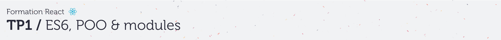
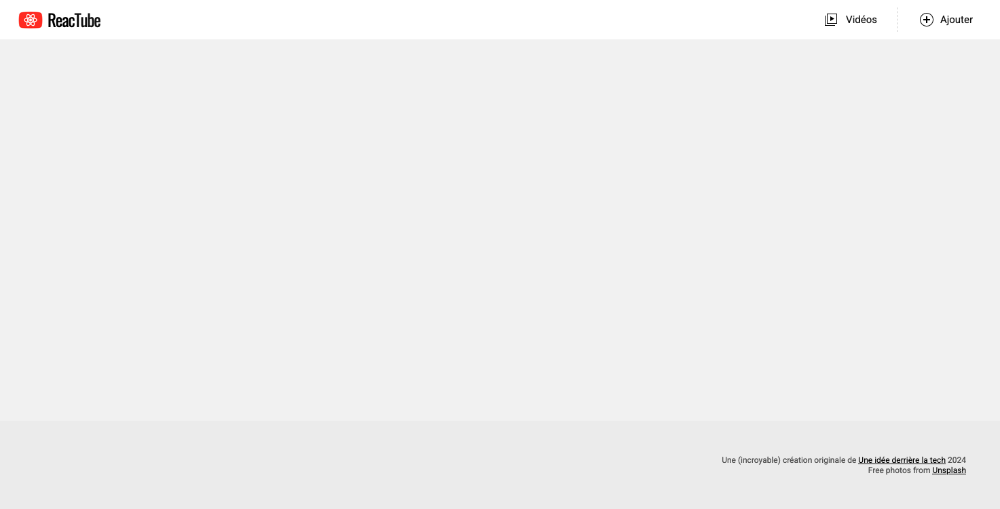

# A. Préparatifs <!-- omit in toc -->

## Sommaire <!-- omit in toc -->
- [A.1. Récupération du projet](#a1-récupération-du-projet)
- [A.2. Lancement du serveur HTTP](#a2-lancement-du-serveur-http)

## A.1. Récupération du projet
**Ce repo contient une solution commentée du précédent TP.** <br>
Pour ce TP vous pouvez soit repartir de vos fichiers du précédent TP (si vous l'aviez terminé) ou bien cloner ce repo et vous en servir comme base pour ce TP (dans ce cas pensez à quand même faire un `git pull` pour récupérer les éventuelles modifications de dernière minute ;) ).

1. **Récupérez les fichiers de ce TP grâce à Git : clonez ce repo dans un dossier de votre choix** :
	```bash
	mkdir ~/tps-react
	git clone https://framagit.org/formation/react/tp1.git ~/tps-react/tp1
	```
	> _**NB :** Comme pour le TP0, ici je clone dans mon dossier `/home/thomas/tps-react/tp1`. **Si vous êtes sous windows faites attention au sens des slashs et au caractère `"~"`** qui représente le dossier de l'utilisateur sur système unix : utilisez **Git bash** (qui comprend cette syntaxe) ou si vous tenez vraiment à utiliser **cmd** ou **powershell** pensez à adapter la commande !_

	> _**NB2 :** Comme pour le TP0 aussi, si vous préférez **cloner en SSH** pour ne pas avoir à taper votre mot de passe à chaque fois que vous clonerez un TP, renseignez votre clé SSH dans votre [compte utilisateur framagit](https://framagit.org/-/profile/keys) et clonez à partir de cette URL : `git@framagit.org:formation/react/tp1.git`_


2. **Ouvrez le projet dans VSCodium** (pour les différentes façon d'ouvrir le projet relisez les [instructions du TP0](https://framagit.org/formation/react/tp0/-/blob/master/A-preparatifs.md#a3-ouvrir-le-projet-dans-vscodium) )
	```bash
	codium ~/tps-react/tp1
	```

## A.2. Lancement du serveur HTTP

**Comme dans le précédent TP (cf. [TP0 / B.1. Lancement d'un serveur HTTP](https://framagit.org/formation/react/tp0/-/blob/master/B-integration.md#b1-lancement-dun-serveur-http) ) lancez un serveur HTTP dans un terminal intégré de VSCodium :**

1. **Ouvrez un terminal intégré dans VSCodium** en tapant <kbd>CTRL</kbd>+<kbd>J</kbd> (PC) / <kbd>CMD</kbd>+<kbd>J</kbd> (Mac) (ou <kbd>CTRL</kbd>+<kbd>SHIFT</kbd>+<kbd>P</kbd> puis `View: toggle panel`).

2. **Lancez un serveur http** :
	```bash
	npx serve -l 8000
	```

3. **Vérifiez dans le navigateur que la page index.html s'affiche correctement et que le message "Welcome to REACTube" s'affiche dans la console** en ouvrant l'url http://localhost:8000.

	Le résultat attendu est le suivant :

	

	> _**NB : Si la page ne s'affiche pas correctement**, vérifiez que vous avez bien lancé le serveur http dans le dossier du projet, c'est à dire celui où se trouve le fichier `index.html`. Puis vérifiez dans la `Console` ou dans l'onglet `Sources` (Chrome) ou `Debugger` (Firefox) qu'l n'y a pas d'erreur JS lorsque la page se charge._

## Étape suivante <!-- omit in toc -->
Si tout fonctionne, vous pouvez passer à l'étape suivante : [B. La POO](B-poo.md)