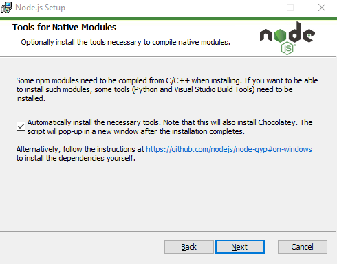

# A. Préparatifs <!-- omit in toc -->

## Sommaire <!-- omit in toc -->
- [A.1. Installations](#a1-installations)
- [A.2. À propos de ce repo](#a2-à-propos-de-ce-repo)
- [A.3. Récupération des fichiers](#a3-récupération-des-fichiers)
- [A.4. VSCod\[e/ium\]](#a4-vscodeium)
- [A.5. Ouvrir le projet dans VSCodium](#a5-ouvrir-le-projet-dans-vscodium)


## A.1. Installations
**Avant de démarrer le TP il va vous falloir faire quelques installs et configurations.** Selon que vous utilisez une machine de l'Université ou votre propre ordinateur la situation n'est pas la même :

### Si vous êtes sur une machine des salles TP de l'IUT <!-- omit in toc -->
Dans ce cas, un certain nombre de logiciels sont déjà pré-installés (notamment Git et VSCode) mais vous aurez quand même besoin d'installer une version de **NodeJS** plus récente que celle fournie de base sur les machines.

Suivez donc [ce tuto spécifique aux machines des salles TP de l'IUT](A-preparatifs-linux.md) puis revenez suivre la suite du TP ici.

### Si vous utilisez votre propre machine <!-- omit in toc -->
Dans ce cas il vous faudra installer :
- **Git** : https://git-scm.com/
- **Node.js** (_version "Current" **22.x**_): https://nodejs.org/en/download/prebuilt-installer/current
	> _**Attention :** si vous aviez déjà une version plus ancienne de Node (tapez `node -v` dans un terminal pour en avoir le coeur net) alors je vous conseille **VIVEMENT** de la désinstaller complètement avant d'installer la nouvelle version._

	> ⚠️ _**ATTENTION AUSSI :**_ ⚠️ _si vous êtes sous Windows, pendant le processus d'installation, **COCHEZ** la case _"Automatically install the necessary tools. ..."_ sur l'écran **"Tools for native modules"**_
	>
	> 
	>
	> _Cette case permettra d'installer des dépendances utiles pour un futur TP (notamment python et les visual c++ build tools)._

- **VSCodium** https://vscodium.com ou **VSCode** https://code.visualstudio.com
	> _**NB :** Si vous avez déjà VSCode, ça fera très bien l'affaire, VSCodium et VSCode sont quasi identiques (_cf. [A.4. VSCod[e/ium]](#a4-vscodeium)_) !_


## A.2. À propos de ce repo

**Ce repo contient un ensemble de fichiers qui vous seront utiles pour la réalisation de ce TP.**

Il contient notamment des fichiers html, css et des assets graphiques (images et vidéos) qui vous permettront de vous concentrer sur le JS sans trop vous soucier de l'apparence de ce que vous codez tout en ayant **quand même** quelque chose de présentable visuellement 😎

La première étape est donc de récupérer (_via git_) les fichiers du TP.<br>
_**Allons-y !**_

## A.3. Récupération des fichiers

**La solution la plus simple pour récupérer les fichiers du TP consiste à cloner ce repository à l'aide de git :**

1. **Commencez par faire un fork du TP :**
	- soit en cliquant sur le bouton `"Créer une divergence"` (_`"Fork"` sur la version anglaise de gitlab_)
	- soit en vous rendant directement sur https://gitlab.univ-lille.fr/react/tp1/-/forks/new

	**⚠️ ATTENTION :** Choisissez de placer votre fork **dans VOTRE profil utilisateur** (`namespace`) \
	et vérifiez que le repo est **bien en mode "private"** (`Visibility Level`)

2. **Ajoutez votre encadrant.e de TP en tant que "reporter" pour qu'il/elle ait accès à votre code :**
	- dans le menu de gauche, cliquez sur **`Manage`** &gt; **`Members`** (`Gestion` &gt; `Membres` _si vous êtes sur la VF de gitlab_)
	- cliquez sur le bouton en haut à droite **`"Invite members"`** (`Inviter des membres`)
	- entrez comme **nom d'utilisateur** celui de votre encadrant.e de TP (`@gery.casiez` ou `@thomas.fritsch`)
	- ... et `"reporter"` comme **rôle**.

3. **Ouvrez un terminal** *(si vous êtes sous Windows, utilisez **Git bash** installé automatiquement avec Git)*

4. **Récupérez ensuite les fichiers de ce TP grâce à Git : clonez votre fork dans un dossier de votre choix** (_dans mon exemple /home/thomas/tps-react/tp1_):
	```bash
	mkdir ~/tps-react
	git clone https://gitlab.univ-lille.fr/<votre-username>/tp1.git ~/tps-react/tp1
	```
	> _**NB1 :** ici je clone dans mon dossier `/home/thomas/tps-react/tp1`. **Si vous êtes sous Windows faites attention au sens des slashs et au caractère `"~"`** qui représente le dossier de l'utilisateur sur système unix : utilisez **Git bash** (qui comprend cette syntaxe) ou si vous tenez vraiment à utiliser **cmd** ou **powershell** pensez à adapter la commande !_

	> _**NB2 :** si ce n'est pas déjà fait, il faut que vous renseigniez un mot de passe dans votre compte gitlab ([`Preferences` > `Password`](https://gitlab.univ-lille.fr/-/profile/password/edit)) pour pouvoir cloner en http_

	> _**NB3 :** si vous préférez **cloner en SSH** pour ne pas avoir à taper votre mot de passe à chaque fois que vous clonerez un TP, renseignez votre clé SSH dans votre [compte utilisateur gitlab](https://gitlab.univ-lille.fr/-/profile/keys) et clonez à partir de cette URL : `git@gitlab-ssh.univ-lille.fr:votre-username/tp1.git`_

## A.4. VSCod\[e/ium\]

_**Pour développer en JS, vous utilisez déjà sans doute un éditeur adapté au JS moderne. Si vous ne l'avez pas encore testé, je ne peux que vous recommander d'utiliser Visual Studio Code / VSCodium au moins pour la durée de ce cours.**_


[Visual Studio Code](https://code.visualstudio.com/) (vscode) est à l'heure actuelle l'un des éditeurs les plus **populaires** pour le développement web et en particulier dans l'écosystème React. C'est un éditeur opensource et développé avec [Electron](https://electronjs.org/), c'est donc un outil qui est **lui-même développé en JS !**

Malheureusement des questions de licence liées à Microsoft [plus ou moins obscures](https://vscodium.com/#why) viennent ternir un peu le tableau. Je vous conseille donc d'utiliser **la distribution "vraiment opensource" du logiciel qu'est [VSCodium](https://vscodium.com/)** (_aucune différence de fonctionnalité, hormis le [store d'extensions](https://github.com/VSCodium/vscodium/blob/master/DOCS.md#extensions-marketplace)_).

> _**NB :** Si vous avez déjà VSCode et que vous ne souhaitez pas faire la bascule vers VSCodium, pas de soucis, comme les deux sont strictement identiques en terme de fonctionnalités (hormis le store d'extension qui diffère), les TP fonctionneront de la même manière avec vscode !_


1. **Ouvrez le panneau des extensions de VSCod\[e/ium\]** à l'aide du raccourci <kbd>CTRL</kbd>+<kbd>SHIFT</kbd>+<kbd>X</kbd>

2. **Installez l'extension `Prettier - Code formatter`** (_esbenp.prettier-vscode_)

	Prettier permet de formater automatiquement notre code en respectant de base un certain nombre de bonnes pratiques. Les possibilités de configuration sont volontairement limitées mais suffisantes pour avoir quand même l'impression d'avoir encore un peu la main sur son formatage 😄

	On configurera cette extension dans les prochains TP.

## A.5. Ouvrir le projet dans VSCodium

_**Pour travailler efficacement avec vscodium, je vous recommande d'ouvrir le DOSSIER de votre projet plutôt que d'ouvrir les fichiers un à un. Cela vous permettra notamment de passer plus rapidement de l'un à l'autre.**_

1. **Commencez donc par ouvrir le dossier du TP dans VSCodium :**
	- soit en lançant VSCodium **depuis un terminal** directement dans le dossier (*adaptez le chemin vers le projet*):
		```bash
		codium ~/tps-react/tp1
		```
		> _**NB :** Si vous utilisez VSCode, la commande `codium` doit être remplacée par `code`_
	- soit en ouvrant VSCodium, et **en glissant le dossier** du TP (_celui dans lequel vous avez cloné_) depuis l'explorateur de fichier/finder directement sur la fenêtre de VSCodium
	- soit en **ouvrant le dossier du projet** avec le raccourci <kbd>CTRL</kbd>+<kbd>O</kbd> ou via le menu `File` > `Open Folder` (_Win_) / `Open` (_Mac_) de VSCodium

2. **Une fois le projet ouvert, profitez-en pour tester quelques raccourcis clavier :**
	- <kbd>CTRL</kbd>+<kbd>P</kbd> : Permet d'ouvrir un fichier à partir de son nom
	- <kbd>CTRL</kbd>+<kbd>SHIFT</kbd>+<kbd>P</kbd> : Permet de lancer n'importe quelle commande de n'importe quel menu
	- <kbd>CTRL</kbd>+<kbd>SHIFT</kbd>+<kbd>:</kbd> : commente/décommente une ligne de code

	- cheat sheet windows : https://code.visualstudio.com/shortcuts/keyboard-shortcuts-windows.pdf
	- cheat sheet mac : https://code.visualstudio.com/shortcuts/keyboard-shortcuts-macos.pdf
	- cheat sheet linux : https://code.visualstudio.com/shortcuts/keyboard-shortcuts-linux.pdf

## Étape suivante <!-- omit in toc -->
Si tout fonctionne, vous pouvez passer à l'étape suivante : [A2. Préparatifs (suite) : Intégration du JS](A2-integration.md)