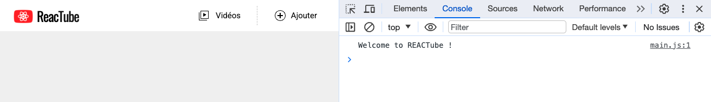

# A2. Préparatifs (suite) : Intégration du JS <!-- omit in toc -->

***Maintenant que l'on a récupéré les fichiers du TP et que notre éditeur de code est prêt, lançons le projet pour voir à quoi ça ressemble !***

## Sommaire <!-- omit in toc -->
- [A2.1. Lancement d'un serveur HTTP](#a21-lancement-dun-serveur-http)
- [A2.2. Inclure le JS dans la page](#a22-inclure-le-js-dans-la-page)
- [A2.3. Tester la page](#a23-tester-la-page)

## A2.1. Lancement d'un serveur HTTP

**Pour consulter notre appli web dans un navigateur, il nous faut un serveur http.** <br>
On pourrait, pour cet exercice, utiliser n'importe quel serveur http (apache, tomcat, etc.) mais je vous propose d'utiliser Node.js (_installé au point A.1._) et **[npx](https://docs.npmjs.com/cli/v8/commands/npx)** qui est une commande fournie automatiquement avec Node (_basée sur [npm : Node Package Manager](https://fr.wikipedia.org/wiki/Npm) dont nous parlerons plus tard_).

1. **Tout d'abord, ouvrez un terminal directement dans VSCodium** en tapant <kbd>CTRL</kbd>+<kbd>J</kbd> (PC) / <kbd>CMD</kbd>+<kbd>J</kbd> (Mac) (_ou <kbd>CTRL</kbd>+<kbd>SHIFT</kbd>+<kbd>P</kbd> puis `View: toggle panel`_).

	> _**NB :** Utiliser le terminal intégré à VSCodium a plusieurs avantages :_
	> - _pas besoin de jongler entre plusieurs fenêtres pour passer de l'IDE au terminal_
	> - _le terminal s'ouvre **directement dans le dossier du projet**_

2. **Dans ce terminal intégré, lancez un serveur http à la racine du TP** :
	```bash
	npx serve -l 8000
	```

	Node télécharge alors le paquet "serve" puis le lance dans le dossier `tp1`. Node se met ensuite en attente de connexions http et affiche quelque chose comme ceci :

	

3. **Vérifiez dans votre navigateur que la page index.html** (fournie dans ce repo) **s'affiche correctement** en ouvrant l'url http://localhost:8000. Le résultat attendu est le suivant :

	

	> _**NB :** Si la page ne s'affiche pas correctement, vérifiez que vous avez bien lancé votre serveur Node avec npx dans **le bon dossier** (c'est-à-dire celui où se trouve le fichier `index.html`)._

## A2.2. Inclure le JS dans la page

**Ce repo est fourni avec un fichier `src/main.js` qu'il va falloir intégrer dans la page html.**

Ouvrez-le d'abord dans VSCodium pour voir à quoi il ressemble à l'aide du raccourci <kbd>CTRL</kbd>+<kbd>P</kbd>, tapez ensuite simplement son nom dans le panneau qui s'est ouvert puis utilisez les flèches directionnelles et la touche `Entrée` pour valider.

**Incluez ensuite le fichier `src/main.js` dans le fichier `index.html`** à l'aide d'une balise `<script>`.

> _**NB :** Pour rappel, il existe plusieurs manières d'intégrer du code JavaScript dans une page HTML :_
> - _**en "inline"** c'est à dire directement dans les attributs d'une balise. Dans l'exemple ci-dessous, le code JS s'exécutera lorsque l'utilisateur cliquera sur le lien :_
>	```html
>	<a href="#" onclick="alert('Welcome to Albuquerque');return false;">
>		BB
>	</a>
>	```
> - _**dans une balise `<script>`.** Le code s'exécute alors au chargement de la page, au moment où le navigateur arrive à cette ligne (le navigateur parse le document html de haut en bas):_
> 	```html
> 	<script>alert('Welcome to Albuquerque');</script>
> 	```
> - _**dans une balise `<script>` avec un attribut `src`**. Dans ce cas le code JS peut alors être externalisé dans un fichier distinct. Le code s'exécute lorsque le fichier est chargé :_
> 	```html
> 	<script src="welcome.js"></script>
> 	```
> **C'est cette dernière technique que nous emploierons car elle permet de bien séparer les responsabilités de notre appli** (*HTML et JS séparés*).

**Attention :** Pour éviter que le chargement du fichier JS ne bloque le chargement de la page HTML (comportement par défaut), il existe 2 solutions :
- placer la balise `<script>` en toute fin de fichier html, juste **avant** la balise fermante `</body>`
- placer la balise `<script>` dans le `<head>` du fichier, mais y ajouter un attribut **`defer`** (cf. [doc](https://developer.mozilla.org/en-US/docs/Web/HTML/Element/script#attr-defer))

C'est cette solution que je préconise car elle présente l'avantage de ne pas mélanger le contenu du document (le `<body>`) avec des informations annexes comme le chargement de scripts JS (qui relèvent plutôt du `<head>`) par ailleurs le support navigateur est très bon (IE10, Android 3+, iOS 5+, etc.)

<a href="https://caniuse.com/#feat=script-defer"></a>


## A2.3. Tester la page
**Testez la page pour vérifier que le js est correctement chargé** : Ouvrez les outils de développement de votre navigateur (touche <kbd>F12</kbd> sur Chrome) et ouvrez le panneau "Console".

Si le fichier `main.js` est correctement chargé, le texte `'welcome to REACTube !'` doit s'afficher dans la console.



En effet, le fichier `main.js` contient l'instruction :

```js
console.log('Welcome to REACTube !');
```

Cette instruction `console.log()` permet d'afficher du texte ou des variables dans la console.

> _**NB :** **Si le texte ne s'affiche pas**, c'est probablement que le fichier `main.js` n'est pas correctement intégré dans la page html :_
>
> _Ouvrez le panneau **"Network"**/**"Réseau"** des devtools puis rechargez la page en désactivant le cache navigateur : touche <kbd>CTRL</kbd>+<kbd>F5</kbd>, ou <kbd>CTRL</kbd>+<kbd>SHIFT</kbd>+<kbd>R</kbd> selon les navigateurs. Assurez-vous que cette fois le fichier `main.js` figure bien dans la liste des fichiers téléchargés. Si ce n'est toujours pas le cas, c'est que votre balise `<script>` n'est pas correcte (vérifiez le chemin vers le fichier)._

**_Pour la suite du TP, tout le code se fera dans ce fichier `main.js`, le fichier html ne devra pas être modifié !_**

## Étape suivante <!-- omit in toc -->
Si tout fonctionne, vous pouvez passer à l'étape suivante : [B. Typescript](B-typescript.md)