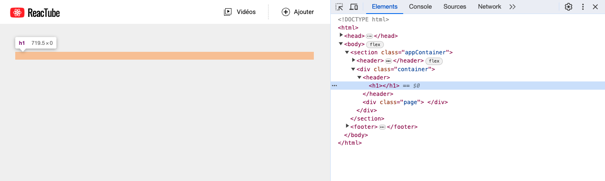
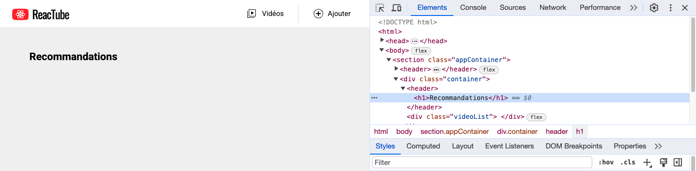
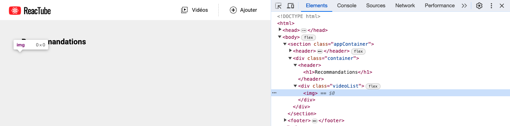

# B. POO <!-- omit in toc -->

_**Nous allons développer dans ce TP une classe `Component` qui va permettre de générer du code HTML en JS.**_

A chaque étape du TP vous allez perfectionner la classe Component pour la rendre capable de gérer des paramètres supplémentaires.

> _**NB :** Dans ce TP vous coderez dans un premier temps vos classes directement dans le fichier `src/main.js` **sans compiler** votre code et **sans passer par des fichiers (modules) séparés**._
>
> _Dans la suite du TP on compilera notre code pour le rendre compatible avec tous les navigateurs, et on organisera notre code plus proprement en séparant les classes dans des modules différents._ \
> _Mais pour le moment on va simplifier la mise en place en remettant ça à plus tard (ne faites pas ça dans la vraie vie !)._

## Sommaire <!-- omit in toc -->
- [B.1. Rappels de syntaxe](#b1-rappels-de-syntaxe)
	- [B.1.1. class \& propriétés publiques](#b11-class-propriétés-publiques)
	- [B.1.2. méthodes](#b12-méthodes)
- [B.2. La classe Component](#b2-la-classe-component)

## B.1. Rappels de syntaxe
### B.1.1. class & propriétés publiques
Comme vu dans le cours (*procurez vous le support pdf !*) ES6 a introduit une nouvelle syntaxe pour la création de classes. Finis les `prototypes`, désormais le mot clé `class` fait son apparition et permet d'utiliser une syntaxe plus proche de ce qui se fait dans les autres langages objets :
```js
class Character {
	constructor(firstName) { // constructeur de la classe
		this.firstName = firstName; // création de propriété
	}
}
const heisenberg = new Character('Walter');
```
La création de propriétés d'instances se fait par l'utilisation du mot clé `this` dans le constructeur : `this.firstName = firstName;` permet de créer une propriété `firstName` sur l'instance en cours de création et de lui assigner la valeur passée au constructeur via l'instruction `new Character('Walter');`.

On peut ensuite accéder aux propriétés de l'objet en utilisant la notation pointée :
```js
console.log( heisenberg.firstName );
```
Il est possible également de déclarer les propriétés d'instance en dehors du constructeur de cette manière :
```js
class Character {
	firstName;
	constructor(firstName) {
		this.firstName = firstName;
	}
}
```
Cette notation a été intégrée tout récemment dans la spec officielle d'ECMAScript (_la spec suivie par JavaScript_) : elle fait partie des fonctionnalités incluses dans ES2022 (ES13) sortie en juin 2022 : cf. https://github.com/tc39/proposals/blob/master/finished-proposals.md et https://github.com/tc39/notes/blob/HEAD/meetings/2021-04/apr-19.md#class-fields-private-methods-and-static-class-features-for-stage-4

Ceci dit, cela fait plusieurs années que Babel permet de l'utiliser !

### B.1.2. méthodes
La création de méthodes d'une classe se fait de la manière suivante :
```js
class Character {
	firstName;
	lastName;
	constructor(firstName, lastName) {
		this.firstName = firstName;
		this.lastName = lastName;
	}
	fullName(){ // déclaration de méthode
		return `${this.firstName} ${this.lastName}`;
	}
}
```
Pour appeler la méthode, on utilise simplement la notation pointée :
```js
heisenberg.fullName();
```

## B.2. La classe Component
1. **Effacez tout le contenu du fichier `src/main.js`**.
2. **Ajoutez dans le fichier `index.html` une balise `<header>`** à l'intérieur de la balise `<div class="container">` comme ceci :
	```html
	<div class="container">
		<header></header>
		<div class="videoList">
		</div>
	</div>
	```
3. **Dans le fichier `src/main.js` créez une classe `Component` qui s'utilise de la manière suivante :**
	```js
	const title = new Component( 'h1' );
	document.querySelector('.container > header').innerHTML = title.render();
	```
	+ **le constructeur** prend en paramètre une chaîne nommée `tagName` pour le moment simplement sauvegardée dans une propriété de l'instance: `this.tagName`
	+ **la classe dispose d'une méthode `render()`**.

  		Cette méthode retourne une chaîne de caractères au format html qui correspond à une balise dont le type dépend de l'attribut `tagName` passé au constructeur.

		Par exemple si `tagName` vaut `'div'` alors `render()` retournera la chaîne de caractères :
		```js
		'<div></div>'
		```
		Dans notre exemple plus haut, `tagName` vaut `'h1'`, `render()` retourne donc :
		```js
		'<h1></h1>'
		```
		> _**NB :** Je vous conseille d'utiliser les **template strings** dans cette méthode, cela vous permettra facilement d'injecter des valeurs dans votre chaîne et en plus de passer des lignes dans la chaîne de caractères pour rendre votre code plus lisible._

	**Vérifiez que votre classe fonctionne correctement en inspectant le code généré par votre application avec l'Inspecteur d'éléments des devtools du navigateur.**

	> _**NB :** On passe par l'inspecteur d'éléments car visuellement à l'écran, c'est difficile de contrôler le rendu : rien ne s'affiche car on n'a pas précisé de contenu au `<h1>` !_

	


4. **Ajoutez un second paramètre au constructeur, nommé `children`.** Modifiez le code de la méthode render() de manière à ce que le code suivant :
    ```js
	const title = new Component( 'h1', 'Recommandations' );
	document.querySelector('.container > header').innerHTML = title.render();
	```
	Injecte dans la page le code suivant :
	```js
	'<h1>Recommandations</h1>'
	```

	Contrôlez que le rendu est bien conforme à la capture suivante :

	

5. **Modifiez le fonctionnement de la méthode render pour prendre en compte le cas où `children` est vide** (`null` ou `undefined`). Par exemple si je crée un Component de ce style :
	```js
	const img = new Component( 'img' );
	```
	`render()` doit retourner `` (_une balise "auto fermante", c'est à dire sans enfants_) et pas `</img>` (_car ce n'est pas un code HTML valide selon la spec du W3C_).

	**Testez votre classe comme ceci** :
	```js
	const img = new Component( 'img' );
	document.querySelector( '.videoList' ).innerHTML = img.render();
	```
	Vérifiez dans **l'inspecteur d'éléments** que votre image est bien ajoutée dans `videoList` :

	> _**NB :** Comme tout à l'heure avec le `h1`, on passe par l'inspecteur d'éléments car visuellement à l'écran, c'est difficile de contrôler le rendu : aucune image ne s'affiche car on n'a pas précisé ni de source ni de taille à l'image !_

	> _**NB2 :** Selon votre navigateur il est possible que l'inspecteur d'éléments n'affiche que `` et pas ``. C'est une simplification faite par les devtools, mais ça ne veut pas dire que votre code ne fonctionne pas. Testez donc votre code avec `console.log(img.render())`, là vous saurez avec certitude si votre méthode retourne bien ``._

	

6. **Ajoutez un paramètre `attribute` en 2e position du constructeur de la classe `Component` : enregistrez ce paramètre dans une propriété d'instance `this.attribute`.**

	La signature du constructeur sera désormais :
	```js
	constructor( tagName, attribute, children ) {
	```
	> _**NB :** comme on modifie la signature du constructeur de `Component`, l'instanciation du component "h1" n'est plus correcte (on passe seulement 2 paramètres au constructeur, le `children` se retrouve donc à la place du `attribute`). Pour régler le problème, vous avez le droit de modifier l'instanciation du h1 en passant `null` au paramètre `attribute` par exemple._

	**Modifiez la méthode `render()` pour prendre en compte le paramètre `attribute`**. On considère que ce paramètre aura toujours la forme d'un objet littéral avec deux propriétés : `name` et `value`. C'est à dire que si le paramètre `attribute` a été fourni au constructeur comme ceci :

	```js
	const img = new Component( 'img', {name:'src', value:'https://source.unsplash.com/wOHH-NUTvVc/600x340'} );
	```

	`render()` doit retourner le code suivant :
	```html
	
	```
	> _**NB :** Pour ne pas alourdir trop le code de la méthode render() je vous recommande de créer une nouvelle méthode `renderAttribute()` -appelée dans la méthode `render()`- qui va être en charge du rendu de l'attribut html._

	Testez ce nouveau code, le rendu devra cette fois être :

	

## Étape suivante <!-- omit in toc -->
Si vous avez terminé cette partie sur la POO, il est l'heure de compiler notre code avec Babel pour le rendre compatible avec les vieux navigateurs. RDV dans la partie suivante : [C. Compiler avec Babel](./C-babel.md)