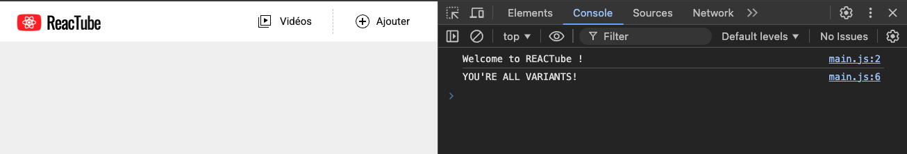

# B. Typescript <!-- omit in toc -->


_**Comme vu en cours TypeScript est un langage qui permet (principalement) d'ajouter du typage statique par dessus JavaScript.**_ \
Ajouter du typage statique à un projet permet d'améliorer à la fois l'expérience de développement (DX) et la robustesse du code produit (tout en permettant d'alléger les tests unitaires, même si ça ce n'est pas dans le scope de cette formation).

## Sommaire <!-- omit in toc -->
- [B.1. Principe](#b1-principe)
- [B.2. Installation et configuration](#b2-installation-et-configuration)
- [B.3. Un premier fichier TS](#b3-un-premier-fichier-ts)


## B.1. Principe

**[TypeScript](https://www.typescriptlang.org/docs/) est un langage développé par Microsoft. Ce n'est donc pas un standard web** (_même si c'est un standard de l'industrie_).

Comme ce n'est pas un standard "officiel" du W3C, ce langage n'est pas supporté par les différents navigateurs : dès qu'on va commencer à mettre du TypeScript dans notre appli, les navigateurs ne pourront plus l'exécuter. 🙁 \
Heureusement, TypeScript dispose d'un **compilateur** ([tsc _(doc)_](https://www.typescriptlang.org/docs/handbook/compiler-options.html)) qui permet de compiler/transpiler le code TypeScript en code JavaScript !

Le principe sera donc le suivant :
- on code en TypeScript dans des fichiers **"source"**
- on compile ensuite le code TS en JS dans un dossier de **"build"**
- on utilise enfin les **fichier compilés** JS dans notre **page HTML**

## B.2. Installation et configuration
**Avant de pouvoir utiliser TypeScript dans notre projet, il faut d'abord l'installer.**

L'installation de TypeScript se fait avec **npm** (_Node Package Manager - l'outil fourni avec Node et qui permet de télécharger des utilitaires JS_).

1. **Tout d'abord, initialisez un projet npm dans votre tp :** dans le terminal de VSCodium tapez la commande :
	```bash
	npm init
	```
	Répondez alors aux questions qui vous sont posées (_donnez le nom "reactube" au projet, vous pouvez ensuite taper <kbd>Entrée</kbd> pour toutes les autres questions_).

	À la fin du questionnaire vous verrez qu'un fichier `package.json` a été créé. Celui-ci nous sera utile dans la suite du TP.

2. **Installez typescript :**
	```bash
	npm install --save-dev typescript
	```
	Ouvrez le fichier `package.json` dans VSCodium (<kbd>CTRL</kbd>+<kbd>P</kbd>). Vous noterez que le paquet `typescript` a été rajouté dans les dépendances du projet !

	Vous remarquerez aussi qu'un dossier `/node_modules` a également été créé à la racine du TP. C'est lui qui contient le code de toutes les dépendances du projet (_toutes les librairies js/ts qu'on installera avec npm_) dont `typescript`.

3. **Pour fonctionner, tsc a besoin d'un fichier de configuration** [`tsconfig.json` _(doc)_](https://www.typescriptlang.org/docs/handbook/tsconfig-json.html).

	Créez donc un fichier `tsconfig.json` à la racine du projet :
	```json
	{
	  "compilerOptions": {
	    "target": "ES2020",
	    "useDefineForClassFields": true,
	    "module": "ESNext",
	    "lib": ["ES2020", "DOM", "DOM.Iterable"],
	    "skipLibCheck": true,
	    "outDir": "build",
	    /* Bundler mode */
	    "moduleResolution": "Bundler",
	    "allowImportingTsExtensions": true,
	    "rewriteRelativeImportExtensions": true,
	    "isolatedModules": true,
	    // "moduleDetection": "force",
	    // "noEmit": true,

	    /* Linting */
	    "strict": true,
	    "noUnusedLocals": true,
	    "noUnusedParameters": true,
	    "noFallthroughCasesInSwitch": true,
	    "noUncheckedSideEffectImports": true
	  },
	  "include": ["src"]
	}
	```
	> <details><summary>ℹ️ C'est quoi toutes ces clés de config ???</summary>
	>
	> _Ce fichier de config est un peu gros pour un projet aussi simple que le notre. A ce stade les seules clés vraiment importantes sont :_
	> - _`target` : version d'ECMAScript vers laquelle compiler le code TS_
	> - _`outDir` : dossier dans lequel `tsc` va placer les fichiers compilés_
	> - _`include` : dossier dans lequel `tsc` va chercher les fichiers source_
	>
	> _Les autres clés de configuration sont reprises de la config générée de base par un outil qu'on utilisera plus tard dans la formation : Vite. On reprend ici cette config pour se simplifier la vie plus tard._
	>
	> _Si vous voulez en savoir plus, la description de chaque clé est disponible dans la doc officielle : https://www.typescriptlang.org/tsconfig/_
	> </detail>


## B.3. Un premier fichier TS

**Maintenant que notre projet est configuré, on va pouvoir coder en TypeScript !**

1. Pour commencer, **changez l'extension du fichier `src/main.js` en `.ts`**.

	Cela permet d'indiquer aux gens qui travailleront sur votre appli (_et au compilateur_) que ce fichier va contenir du code TypeScript.

2. **Ajoutez dans le fichier `src/main.ts` le code suivant :**
	```ts
	function shoutify(value) {
		return value;
	}
	console.log( shoutify('You\'re All Variants!') );
	```

	Il s'agit d'un code purement JS pour l'instant. Mais l'un des intérêts de passer à TS c'est qu'une fois qu'on y ajoute des informations de typage statique on bénéficie d'assistance à la saisie plus poussée. Modifiez par exemple la signature de la fonction `shoutify` en y ajoutant le type `string` au paramètre `value` :
	```ts
	function shoutify(value:string) {
	```
	Grâce à cette annotation, vscode sait que `value` est une chaîne de caractères et devient capable de nous assister plus finement ! Sur la ligne du `return`, juste après `value` tapez un `.` : vscode vous suggère alors automatiquement toutes les propriétés et méthodes du type string ! Sélectionnez la méthode `toUpperCase()` par exemple :
	```ts
	return value.toUpperCase();
	```

	Le deuxième intérêt du typage c'est que si on code "mal" l'éditeur va nous le dire (_meilleur linter_). Essayez d'ajouter dans votre fichier le code suivant :
	```ts
	shoutify(42);
	```
	vscode vous souligne en rouge le nombre `42`. Au survol le message d'erreur apparaît :
	> _"Argument of type 'number' is not assignable to parameter of type 'string'."_

	Il a ainsi détecté qu'on appelait notre fonction avec une valeur du **mauvais type** et nous alerte qu'on doit corriger notre code. Superbe.

	Bon si c'est compris supprimez ou corrigez cette dernière ligne avant de passer à la suite.

3. **Maintenant qu'on a un fichier avec du code TypeScript dedans il reste à le compiler en JS pour pouvoir l'exécuter dans le navigateur.** On va faire ça à l'aide du compilateur `tsc` installé avec typescript tout à l'heure.

	En effet, si vous regardez à l'intérieur du dossier `/node_modules` vous verrez qu'un dossier `/node_modules/typescript/` a été créé par notre commande `npm install...` de la partie [B.2.](#b2-installation-et-configuration) (_avec à l'intérieur le code de TypeScript_). A côté de ce dossier, vous voyez un dossier `/node_modules/.bin` qui contient -entre autre- l'exécutable `tsc` (_oh quelle chance !_).

	Pour lancer la compilation, il suffit de lancer cet exécutable en ligne de commande :
	```bash
	./node_modules/.bin/tsc
	```

	Conformément à notre fichier `tsconfig.json` créé tout à l'heure, `tsc` va compiler notre code dans un nouveau dossier `/build`. Regardez le contenu du dossier, il contient en principe maintenant un fichier `/build/main.js` avec notre code TS converti en JS :
	```js
	"use strict";
	console.log('Welcome to REACTube !');
	function shoutify(value) {
	    return value.toUpperCase();
	}
	console.log(shoutify('You\'re All Variants!'));
	```
	Comme vous le voyez la seule modif vraiment visible c'est le typage du paramètre `value` qui a disparu. Et c'est à peu près tout (_tsc a aussi ajouté une instruction "use strict" au début mais c'est anecdotique_).

	> <details><summary>ℹ️ C'est quoi "use strict" ?</summary>
	>
	> _Le mode strict permet de rendre le navigateur qui exécute notre code JS moins "tolérant" quand il se trouve face à du code ES5._
	>
	> _Par défaut le navigateur autorise certaines aberrations héritées d'ES3 (comme la possibilité de déclarer plusieurs variables avec le même nom dans le même scope par exemple). Le mode strict permet donc de désactiver cette tolérance pour détecter plus facilement les erreurs._
	>
	> _La doc : https://developer.mozilla.org/fr/docs/Web/JavaScript/Reference/Strict_mode_
	> </details>

4. Il ne reste plus qu'à **intégrer ce fichier JS compilé dans notre page HTML**, à la place de notre ancien fichier `src/main.js`.

	Modifiez la balise `<script>` pour pointer vers `build/main.js`.

	Rechargez la page dans votre navigateur vous devez en principe voir dans la console le texte "YOU'RE ALL VARIANTS!"

	

5. Relancez la compilation mais cette fois avec l'option "--watch" :
	```bash
	./node-modules/.bin/tsc --watch
	```
	Avec ce paramètre, le compilateur va tourner "en boucle" et relancer la compilation dès qu'un fichier sera modifié. Faites une modif rapide du fichier `/src/main.ts` et constatez que le compilateur régénère automatiquement le fichier `/build/main.js`. Pratique !


## Étape suivante <!-- omit in toc -->
Maintenant que notre projet est prêt pour utiliser TypeScript, passons à un exercice de code : [C. La fonction renderElement](./C-renderelement.md)