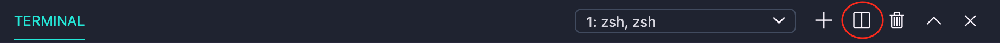
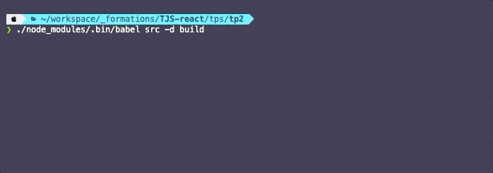
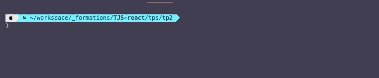
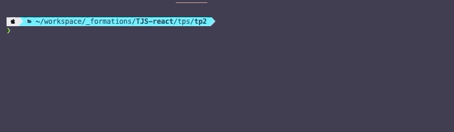

# C. Compiler avec Babel <!-- omit in toc -->


_**Jusque là on ne s'est pas préoccupé de la compatibilité navigateur du code que l'on a tapé.**_

En revanche dans la vraie vie, si l'on veut que tous les internautes puissent utiliser notre application sans encombre, **il faut compiler notre code ES6+ en ES5**. Cette compilation se fait avec [Babel](https://babeljs.io).

## Sommaire <!-- omit in toc -->
- [C.1. Installation et configuration](#c1-installation-et-configuration)
- [C.2. Compilation](#c2-compilation)
- [C.3. Le fichier `package.json`](#c3-le-fichier-packagejson)
- [C.4. Créer un script de build personnalisé](#c4-créer-un-script-de-build-personnalisé)


## C.1. Installation et configuration
L'installation de Babel se fait avec npm (Node Package Manager - l'outil fourni avec Node et qui permet de télécharger des utilitaires JS).

1. **Tout d'abord, ouvrez un nouveau terminal intégré dans VSCodium** (_vous en avez normalement déjà un qui exécute le serveur http `npx serve -l 8000`_).

	Je vous recommande d'utiliser ici [un terminal splitté](https://code.visualstudio.com/docs/editor/integrated-terminal#_terminal-splitting) pour afficher deux terminaux côte à côte : tapez <kbd>CTRL</kbd>+<kbd>SHIFT</kbd>+<kbd>P</kbd> puis **`Terminal: split terminal`** ou **cliquez sur l'icône suivante** :

	

	L'avantage du terminal splitté, c'est que vous pouvez garder un oeil sur les deux terminaux en parallèle. Pratique !

2. **Initialisez votre projet npm :** dans le terminal de VSCodium tapez la commande :
	```bash
	npm init
	```
	Répondez alors aux questions qui vous sont posées (_donnez le nom "reactube" au projet, vous pouvez ensuite taper <kbd>Entrée</kbd> pour toutes les autres questions_). À la fin du questionnaire vous verrez qu'un fichier `package.json` a été créé. Celui-ci nous sera utile par la suite.

3. **Installez babel :**
	```bash
	npm install --save-dev @babel/core @babel/cli
	```
	Ouvrez le fichier `package.json` dans VSCodium (<kbd>CTRL</kbd>+<kbd>P</kbd>). Vous noterez que les paquets `@babel/core` et `@babel/cli` ont été rajoutés dans les dépendances du projet !

	Vous pourrez aussi remarquer qu'un dossier `node_modules` a également été créé. C'est lui qui contient le code de toutes les dépendances du projet (toutes les librairies js qu'on a installé avec npm).

4. **Installez le preset `env` :**

	Un **preset** est une sorte de dictionnaire qui indique à babel la syntaxe à compiler (_sans preset, Babel n'applique aucune modification au code source_). Le preset `env` permet de transpiler **toutes les features officielle ES6+ en ES5** (c'est une sorte de dictionnaire de traduction ES6+ -> ES5) :
	```bash
	npm install --save-dev @babel/preset-env
	```

5. **Enfin, créez un fichier `.babelrc` à la racine de votre projet** (_au même niveau que le `index.html` et le `package.json`_) pour dire à Babel d'utiliser le preset `env` que l'on vient d'installer :
	```json
	{
		"presets": ["@babel/env"]
	}
	```
	> _**NB :** le nom du fichier à créer est bien **`.babelrc`**. Si vous êtes sous windows vous ne pourrez pas créer ce fichier avec l'explorateur de fichiers (windows vous oblige à choisir un nom de fichier de la forme `nom-du-fichier.extension`) utilisez donc VSCodium pour ça : <kbd>CTRL</kbd>+<kbd>N</kbd> puis <kbd>CTRL</kbd>+<kbd>S</kbd>_

## C.2. Compilation
1. **Vous pouvez maintenant compiler votre code ES6+ en ES5 à l'aide de la commande** :
	```bash
	./node_modules/.bin/babel src -d build
	```

	

	Cette commande va créer un dossier `build` dans lequel sera placé le fichier `main.js` compilé !

	Vérifiez que le fichier `build/main.js` est bien compilé et qu'il ne reste plus de traces de code ES6 (const, let, ...). Si ce n'est pas le cas (s'il reste des `const`, des template strings ou des arrow functions), c'est que le `.babelrc` est mal configuré ou que vous avez raté une étape !

2. **Une fois le fichier `build/main.js` créé, modifiez le fichier `index.html` pour charger ce fichier à la place du `src/main.js`.** Rechargez la page pour vérifier que tout fonctionne toujours correctement !

## C.3. Le fichier `package.json`

**Avec la commande `npm init` nous avons créé un fichier `package.json` dans le projet.**

Ce fichier sert à plusieurs choses et notamment :
1. **Il permet de conserver l'historique de tous les paquets qui sont installés dans le projet.** C'est en quelque sorte l'équivalent du fichier `pom.xml` en JAVA ou encore du `composer.json` en PHP. Vérifiez que dans la section `devDependencies` sont bien listés les paquets suivants :
	- `@babel/cli`
	- `@babel/core`
	- `@babel/preset-env`

	À chaque fois qu'on installe un paquet npm :

	1. le paquet en question se télécharge dans le dossier `node_modules`
	2. puis le nom du paquet ainsi que sa version sont automatiquement ajoutés dans le fichier `package.json`.

	> _**NB :** Le dossier **`node_modules` n'est jamais versionné** (c'est en général un dossier relativement volumineux) mais le **`package.json` lui l'est** car il servira de "recette" pour indiquer aux développeurs qui rejoindraient le projet quels sont les paquets nécessaires._
	>
	> _En effet, grâce au `package.json`, un nouveau développeur n'a qu'à exécuter la commande `npm install` (sans préciser de nom de paquet) pour installer automatiquement toutes les dépendances du projet (c'est d'ailleurs ce que vous ferez dans les prochains TPs_ 🙂 _) !_

2. **Dans ce fichier on va également pouvoir ajouter des "scripts personnalisés" que l'on pourra lancer à l'aide de la commande `npm run xxxxx`.** C'est cette dernière possibilité que l'on va maintenant exploiter pour nous simplifier la vie dans la suite du TP.

## C.4. Créer un script de build personnalisé
Jusque là pour lancer la compilation avec [Babel](https://babeljs.io), nous avons vu qu'il fallait exécuter la commande suivante :

```bash
./node_modules/.bin/babel src -d build
```

Grâce au `package.json` on va créer **un "raccourci"** pour lancer cette commande plus facilement.

1. **Dans VSCodium, ouvrez le fichier `package.json`** en tapant <kbd>CTRL</kbd>+<kbd>P</kbd> puis le nom du fichier ( <kbd>Enter</kbd> _pour ouvrir le fichier_)
2. **Localisez la section "scripts" du fichier**. Elle doit ressembler à :
	```json
	"scripts": {
		"test": "echo \"Error: no test specified\" && exit 1"
	},
	```
3. **Cette section permet d'ajouter des tâches qui pourront être lancées à l'aide de la commande `npm run <nom-du-script>`.** Par défaut le `package.json` contient une tâche `"test"`. Lancez donc ce script `"test"` en tapant :
	```bash
	npm run test
	```
	Vous verrez la commande `"echo \"Error: no test specified\" && exit 1"` s'exécuter dans le terminal :

	

	`"test"` est donc une sorte d'**alias**, de **"raccourci"**, permettant de lancer une commande plus complexe.
4. **Ajoutez maintenant dans le `package.json` un nouveau script qu'on appellera "build"** et qui permettra de lancer la compilation Babel :
	```json
	"scripts": {
		"test": "echo \"Error: no test specified\" && exit 1",
		"build": "babel src -d build"
	},
	```
	> _**NB :** Vous noterez que **le chemin `./node_modules/.bin/`** que l'on utilisait jusque là dans notre commande de compilation **n'est ici plus nécessaire** : en effet, comme l'on se trouve dans un script npm, node va aller chercher les exécutables directement dans le dossier `./node_modules/.bin/`, plus besoin donc de le préciser !_

5. **Lancez la commande `npm run build`** et constatez avec émerveillement que la compilation babel se lance !

	

	> _**NB :** Si la compilation ne se lance pas, plusieurs raisons sont possibles :_
	> - _soit Babel n'est pas correctement installé,_
	> - _soit la section "scripts" n'est pas correctement formatée (pensez qu'il s'agit d'un fichier JSON, par conséquent l'oubli d'une **virgule** entre chaque script ou au contraire l'ajout d'une virgule à la fin du dernier script, sont considérés comme des **erreurs** de syntaxe)._

6. **Ajoutez un nouveau script nommé `"watch"`** qui permettra de lancer la commande :
	```bash
	./node_modules/.bin/babel src -d build --verbose --watch --source-maps
	```

	> _**NB :** Inspirez-vous de la commande que l'on a tapée pour le "build" : comme on est dans un script npm, il y a moyen de simplifier la commande ! Si vous ne voyez pas où je veux en venir, relisez donc le **NB** du point D.4.4. ..._

	Lancez la commande `npm run watch` dans votre terminal et vérifiez que lorsque vous modifiez le fichier `src/main.js`, le fichier `build/main.js` est bien mis automatiquement à jour.

	

	Vous voyez que le watch ne vous rend pas la main sur le terminal, il faut en effet le laisser ouvert car il va permettre de recompiler automatiquement à chaque fois que vous modifierez un fichier ! Essayez de modifier le contenu du fichier main.js, vous verrez que la compilation se relance toute seule !


## Étape suivante <!-- omit in toc -->
Maintenant que votre code compile, vous pouvez passer à l'étape suivante : [D. Les modules](./D-modules.md)