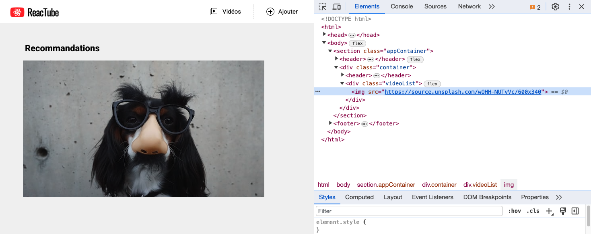
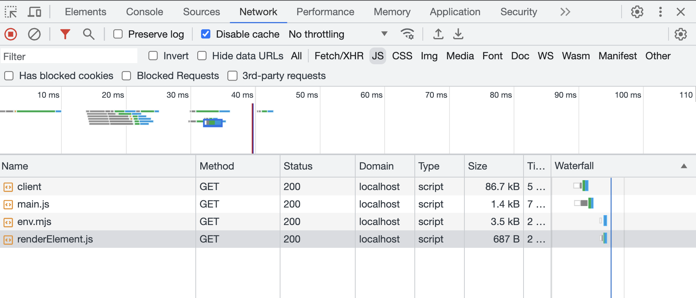

# D. Les modules <!-- omit in toc -->

_**Notre application Reactube a bien progressé.**_

Malheureusement tout notre code réside dans le seul fichier `main.js` : **ça commence par conséquent à être un peu le "bazar" puisque tout est mélangé.**

**L'objectif de ce chapitre va être de nous permettre de mieux organiser notre code en le répartissant dans plusieurs fichiers grâces aux modules ES6.**

## Sommaire <!-- omit in toc -->
- [D.1. Rappels](#d1-rappels)
- [D.2. Mise en oeuvre](#d2-mise-en-oeuvre)

## D.1. Rappels
**Comme vu en cours, le système de modules ES6 permet de répartir son code dans plusieurs fichiers et de gérer les dépendances de l'application fichier par fichier** (_plutôt que d'avoir à maintenir une longue liste de balises `<script>` dans le fichier html_).

Par exemple, si l'on a deux fichiers `main.js` et `vehicle.js`, on peut partager une variable de l'un à l'autre grâce aux instructions `import` et `export` :
```js
// vehicle.js
const vehicle = 'the RV';
export default vehicle;
```
```js
// main.js
import vehicle from './vehicle.js';
console.log( vehicle ); // 'The RV'
```

Dans l'exemple ci-dessus on utilise un **export par défaut** (_`export default ...`_) mais il existe un deuxième type d'export : les **exports nommés** (_`named exports` en anglais_). \
Si l'on réécrit l'exemple ci-dessus avec un export nommé cela donnera :
```js
// vehicle.js
export const vehicle = 'the RV';
```
```js
// main.js
import {vehicle} from './vehicle.js';
console.log( vehicle ); // 'The RV'
```

Les export nommés diffèrent des `export default` parce que :
- on peut avoir plusieurs exports "nommés" mais **un seul export "default"**
- pour importer une valeur exportée avec un export nommé, on est obligé de mettre des **accolades** autour du nom de la variable dans l'import
- on est obligés d'écrire le nom de la variable qu'on importe **EXACTEMENT** comme elle est écrite dans le module qui exporte (_pas de faute de frappe, même casse, etc._), alors que pour les `export default` on peut importer en mettant n'importe quel nom (_le nom de l'export est en fait "default"_)

Le [support navigateur des modules ES6](https://caniuse.com/#feat=es6-module) est plutôt bon (_peut-être un peu juste certaines applications qui nécessiteraient le support de IE et android 4.4_) :

<a href="http://caniuse.com/#feat=es6-module">
	<picture>
		<source type="image/webp" srcset="https://caniuse.bitsofco.de/image/es6-module.webp">
		<source type="image/png" srcset="https://caniuse.bitsofco.de/image/es6-module.png">
		
	</picture>
</a>

Dans un premier temps nous ferons de toute façon abstraction de ces questions de compatibilité et nous nous appuierons sur le fait que **les dernières versions de Chromium/Chrome et de FireFox supportent nativement les modules ES6**.

Nous verrons plus tard dans le TP comment rendre nos modules compatibles avec les vieux navigateurs grâce à un bundler.

## D.2. Mise en oeuvre
1.  **Avant d'utiliser le système de modules et les instructions `import`/`export`, il faut d'abord indiquer au navigateur que notre fichier `main.js` est lui-même un module.** Pour cela, ajoutez un attribut `type="module"` dans la balise `<script>` du fichier `index.html` :
	```html
	<script type="module" src="src/main.js"></script>
	```
	> _**NB :** Vous noterez que l'attribut `"defer"` n'est plus nécessaire car il est implicite pour les modules !_

3. Si pour les modules avec un bundler (_comme Vite par exemple, cf. suite du TP_) on peut omettre l'extension du fichier qu'on importe, ce n'est pas le cas avec les modules "dans le navigateur" comme on s'apprête à le faire : il faut **obligatoirement préciser à chaque `import ... from ...` l'extension `.js` après le nom du fichier**.

	Pour que vscode vous aide à créer les instructions import correctement, **Ajoutez un dossier `.vscode` à la racine du TP**  (_à côté du fichier `index.html`_) **et placez y un fichier nommé `settings.json`** avec le contenu suivant :

	```json
	{
		"[javascript]": {
			"javascript.preferences.importModuleSpecifierEnding": "js"
		}
	}
	```

4.  **Créez votre premier module en externalisant la fonction `renderElement` dans un module ES6 distinct `src/renderElement.js`.**

	> _**NB1 :** Rappelez vous : tout ce qui est défini dans un module (variables, fonctions, classes), n'existe qu'à l'intérieur de ce module **SAUF** s'il est exporté, puis **importé** dans un autre fichier._

	> _**NB2 :** Exporter **par défaut** une constante sur la même ligne que sa création est interdit (cf. la Bible : [stackoverflow](https://stackoverflow.com/a/36261387)):_
	> ```js
	> export default const data = [...]; // ERREUR !
	> ```
	> _Il faut obligatoirement faire cela en deux étapes :_
	> ```js
	> const data = [...];
	> export default data; // OK !
	> ```

	> _**NB3 :** Un export nommé (pas par défaut) d'une const est en revanche autorisé :_
	> ```js
	> export const data = [...]; // OK !
	> ```

	> _**NB4 :** Cette restriction ne s'applique pas aux fonctions et aux classes ; on peut tout à fait faire :_
	> ```js
	> export default class Component {...} // OK !
	> ```
	> ```js
	> export default function checkValue(value){...} // OK aussi !
	> ```

5. **Testez la page dans le navigateur**, le résultat doit être identique à celui obtenu précédemment :

	

6. **Ouvrez l'onglet Réseau/Network des devtools, vous devez normalement voir le chargement automatique du module `renderElement.js`** :

	

	On voit ainsi une des limites des modules ES6 : si l'on a plusieurs dizaines/centaines/milliers de modules dans un projet, on va déclencher en cascade autant de requêtes http que l'on a de modules dans le projet 😱

	Heureusement il existe des outils appelés "bundlers", qui permettent de régler ce problème ! Comme la vie est bien faite, c'est justement ce qu'on va voir dans la prochaine partie de ce TP ! 😌


## Étape suivante <!-- omit in toc -->
Maintenant que les modules sont en place, voyons donc comment configurer un des outils de build JS les plus populaires actuellement : [D. Vite](D-vite.md)
