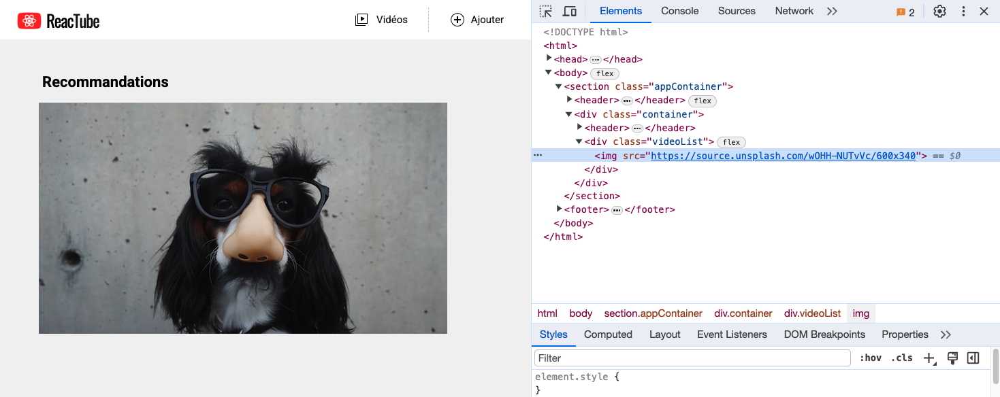

# D. Les modules <!-- omit in toc -->

## Sommaire <!-- omit in toc -->
- [D.1. Rappels](#d1-rappels)
- [D.2. Support natif dans les navigateurs modernes](#d2-support-natif-dans-les-navigateurs-modernes)
- [D.3. Rendre les modules compatibles avec les vieux navigateurs](#d3-rendre-les-modules-compatibles-avec-les-vieux-navigateurs)
- [D.4. mode dev vs mode prod](#d4-mode-dev-vs-mode-prod)
- [Étape suivante](#étape-suivante)

## D.1. Rappels
**Comme vu en cours, le système de modules ES6 permet de répartir son code dans plusieurs fichiers et de gérer les dépendances de l'application fichier par fichier** (*plutôt que d'avoir à maintenir une longue liste de balises `<script>` dans le fichier html*).

Par exemple, si l'on a deux fichiers `main.js` et `vehicle.js`, on peut partager une variable de l'un à l'autre grâce aux instructions `import` et `export` :
```js
// vehicle.js
const vehicle = 'the RV';
export default vehicle;
```
```js
// main.js
import vehicle from './vehicle.js';
console.log( vehicle ); // 'The RV'
```

Le [support navigateur des modules ES6](https://caniuse.com/#feat=es6-module) est plutôt bon mais encore un peu juste pour des applications grand public *(absence de support sur IE et android 4.4)*.

<a href="http://caniuse.com/#feat=es6-module">
	<picture>
		<source type="image/webp" srcset="https://caniuse.bitsofco.de/image/es6-module.webp">
		<source type="image/png" srcset="https://caniuse.bitsofco.de/image/es6-module.png">
		
	</picture>
</a>

Dans un premier temps nous ferons abstraction de ces questions de compatibilité et nous nous appuierons sur le fait que **les dernières versions de Chromium/Chrome et de FireFox supportent nativement les modules ES6**.

Nous verrons plus tard dans le TP comment rendre nos modules compatibles avec les vieux navigateurs grâce à Webpack.

## D.2. Support natif dans les navigateurs modernes
1.  **Avant d'utiliser le système de modules et les instructions `import`/`export`, il faut d'abord indiquer au navigateur que notre fichier `main.js` est lui-même un module.** Pour cela, ajouter un attribut `type="module"` dans la balise `<script>` du fichier `index.html` :
	```html
	<script type="module" src="build/main.js"></script>
	```
	Vous noterez que l'attribut `"defer"` n'est plus nécessaire car il est implicite pour les modules !
2. **Il faut ensuite configurer Babel.** En effet, par défaut Babel va chercher à compiler toutes les instructions `import` et `export` qu'il trouvera pour les transformer en code compatible ES5. Ici on veut utiliser le support natif du navigateur pour les modules ES6, par conséquent il faut indiquer à Babel de ne pas compiler les `import`/`export`.<br>
	Modifiez le fichier `.babelrc` comme suit (**attention: notez bien le tableau dans un tableau !**) :
	```json
	"presets": [
		["@babel/env", {"modules": false}]
	],
	```
	Pour prendre en compte la nouvelle configuration de Babel, stoppez (<kbd>CTRL</kbd>+<kbd>C</kbd>) puis relancez la compilation à l'aide de la commande `npm run watch`

1.  **Passez enfin les classes `Component` et `Img` dans des modules ES6 distincts** (`src/Component.js` et `src/Img.js`).

	***Rappelez vous :** tout ce qui est défini dans un module (variables, fonctions, classes), n'existe qu'à l'intérieur de ce module **SAUF** s'il est exporté, puis importé dans un autre fichier.*

	Le fichier `main.js` conservera uniquement :
    - l'instanciation et l'affichage (`render()`) du composant de titre
    - l'instanciation et l'affichage (`render()`) de l'image

	***NB1 :** Exporter **par défaut** une constante sur la même ligne que sa création est interdit (cf. la Bible : [stackoverflow](https://stackoverflow.com/a/36261387)):*
	```js
	export default const data = [...]; // ERREUR !
	```
	*Il faut obligatoirement faire cela en deux étapes :*
	```js
	const data = [...];
	export default data; // OK !
	```
	***NB2 :** Un export simple (pas par défaut) est en revanche autorisé :*
	```js
	export const data = [...]; // OK !
	```
	***NB3 :** Cette restriction ne s'applique pas aux fonctions et aux classes ; on peut tout à fait faire :*
	```js
	export default class Component {...} // OK !
	```
	```js
	export default function checkValue(value){...} // OK aussi !
	```

2. **Compilez votre code et testez la page dans le navigateur** : le résultat doit être identique à celui obtenu précédemment :<br><a href="images/readme/screen-02.png"></a>

3. **Ouvrez l'onglet Réseau/Network des devtools, vous devez normalement voir le chargement automatique des différents modules** (une ligne par fichier JS)

	

## D.3. Rendre les modules compatibles avec les vieux navigateurs

**Pour rendre nos modules compatibles avec les anciens navigateurs, il faut utiliser un "bundler".**

Le but d'un "bundler" est de rassembler tous les scripts de notre application (toutes les dépendances) en un seul gros fichier JS. Le navigateur n'ayant plus alors qu'un seul fichier à charger, il n'a plus à se soucier des modules.

Comme vu en cours, le bundler le plus employé en JS est [Webpack](https://webpack.js.org/), c'est donc cet outil que l'on va installer et configurer.

1. **Dans le fichier `index.html`, retirez l'attribut `type="module"` de la balise script et remettez l'attribut `defer`. Remplacez aussi le nom du fichier `build/main.js` par `build/main.bundle.js`** (*c'est en effet une pratique courante de nommer les fichiers de ce type avec le mot "bundle"*).

2. **Installez webpack** à l'aide de la commande suivante (*prenez garde à la lancer à la racine de votre TP, là où se trouve le fichier `package.json`*):
	```bash
	npm install --save-dev webpack webpack-cli babel-loader
	```
3. **Créez à la racine de votre TP un fichier `webpack.config.js`** (au même niveau que le `package.json` et le `.babelrc`) et placez y le code suivant :
	```js
	const path = require('path');

	module.exports = {
		// Fichier d'entrée :
		entry: './src/main.js',
		// Fichier de sortie :
		output: {
			path: path.resolve(__dirname, './build'),
			filename: 'main.bundle.js'
		},
		// connexion webpack <-> babel :
		module: {
			rules: [
				{
					test: /\.js$/, // tous les fichiers js ...
					exclude: /node_modules/, // ... sauf le dossier node_modules ...
					use: { // ... seront compilés par babel !
						loader: 'babel-loader',
					}
				}
			]
		},
		devtool: 'source-map'
	}
	```

4. **Modifiez les scripts `"build"` et `"watch"` du fichier `package.json` pour replacer babel par webpack** (*notez quand même que babel sera toujours utilisé mais en arrière plan par webpack grâce au `webpack.config.js` que l'on vient d'écrire*):
	```json
	"build": "webpack --mode=production",
	"watch": "webpack --mode=development --watch"
	```
5. **Lancez la compilation** : stoppez le watch précédent (<kbd>CTRL</kbd>+<kbd>C</kbd>), effacez tout le contenu du dossier `build` et relancez la compilation à l'aide de la commande `npm run watch` (*qui lancera cette fois webpack et non plus Babel*)

6. **Enfin, vérifiez dans le navigateur que la page s'affiche toujours** et que dans l'onglet "Réseau"/"Network" vous n'avez maintenant bien plus qu'un seul fichier JS téléchargé par le navigateur : le `build/main.bundle.js`

	

## D.4. mode dev vs mode prod

Vous l'aurez peut-être remarqué, les deux scripts que l'on vient d'ajouter au fichier `package.json` utilisent un paramètre "mode" avec une valeur différente. Voyons l'impact de ce paramètre :

1. **Renommez** le fichier `build/main.bundle.js` en `build/main.bundle.dev.js`
2. Stoppez la commande `npm run watch` (<kbd>CTRL</kbd>+<kbd>C</kbd>) et **lancez à la place la commande `npm run build`**.
3. **Comparez** le fichier `main.bundle.js` généré avec le mode "production" et le `main.bundle.dev.js` qui avait été généré en mode "development". A votre avis, quelle est l'utilité du mode "production" ?
4. **Demandez au formateur qui encadre votre séance TP si vous avez vu juste avant de passer à la suite.**

## Étape suivante
Maintenant que les modules sont en place, et s'il vous reste du temps dans ce TP vous pouvez travailler sur des concepts de POO plus avancés : [E. Pour aller plus loin : POO avancée](E-poo-avancee.md)
