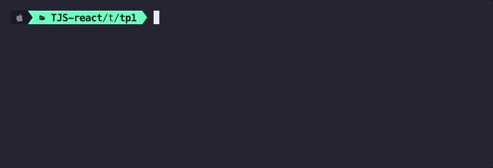
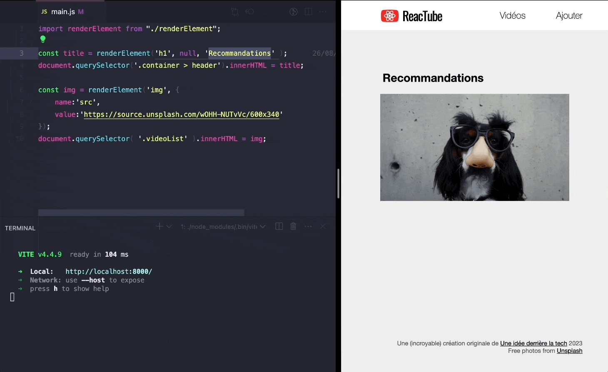
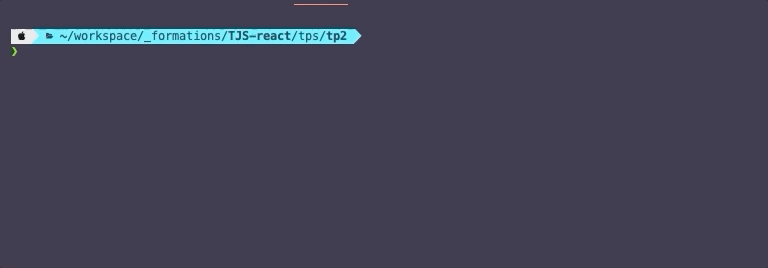
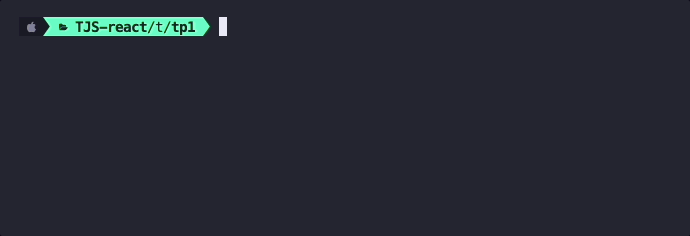

# D. Vite <!-- omit in toc -->

_**Jusque là on ne s'est pas préoccupé de la compatibilité navigateur du code que l'on a tapé, que ce soit pour les syntaxes ES6 employées ou pour les modules.**_

En revanche dans la vraie vie, si l'on veut que tous les internautes puissent utiliser notre application sans encombre, **il faut compiler notre code ES6+ en code compatible avec une majorité de navigateurs (par exemple ES6 ou ES5)**.

Il existe plusieurs outils pour faire ce genre d'opérations, nous utiliserons ici l'un des plus populaires : [Vite](https://vitejs.dev/).

## Sommaire <!-- omit in toc -->
- [D.1. Présentation](#d1-présentation)
- [D.2. Installation](#d2-installation)
- [D.2. Lancer le serveur de développement](#d2-lancer-le-serveur-de-développement)
- [D.3. Le fichier `package.json`](#d3-le-fichier-packagejson)
- [D.4. Créer un script de build personnalisé](#d4-créer-un-script-de-build-personnalisé)


## D.1. Présentation


_**Vite est un outil qui vise à simplifier le setup d'un projet JS en embarquant plusieurs outils déjà pré-configurés, notamment :**_
- _**un bundler ([rollup](https://rollupjs.org/)) :**  qui permet de fusionner les modules en un seul fichier (appelé "bundle")_
- _**un compilateur de code ES6+ ([esbuild](https://esbuild.github.io/)):** qui permet d'utiliser dans son code les dernières syntaxes ECMAScript les plus modernes et de compiler notre code dans une version d'ECMAScript plus ancienne (par défaut ES6) et largement supportée par un maximum de navigateurs._
- _**différents outils qui simplifient la vie du développeur+** comme par exemple un serveur de développement qui permet de tester son appli sans passer par `npx serve`, un système de ["hot reload"](https://vitejs.dev/guide/features.html#hot-module-replacement), la [minimisation des CSS](https://vitejs.dev/guide/features.html#css), le [support de React](https://vitejs.dev/guide/features.html#jsx), etc._

L'avantage d'utiliser Vite est donc que l'on a, avec un seul package, un environnement de dev et de build prêt à l'emploi, qu'il aurait fallu sinon installer et configurer à la main, et c'est souvent très compliqué (_à titre d'exemple, les précédentes versions de ce TP utilisaient Webpack comme bundler, Babel comme compilateur, webpack-dev-server comme serveur de développement, et enfin react-refresh + react-refresh-webpack-plugin pour le hot reload, ça faisait beaucoup !_).

Par ailleurs, Vite va, comme son nom l'indique... vite ! Il est en effet beaucoup [plus rapide que la solution webpack+babel](https://storybook.js.org/blog/storybook-performance-from-webpack-to-vite/) par exemple.

## D.2. Installation

_**L'installation de Vite se fait avec npm (Node Package Manager - l'outil fourni avec Node et qui permet de télécharger des utilitaires JS).**_

1. **Tout d'abord, commencez par stopper la commande `npx serve -l 8000`,** nous n'allons plus en avoir besoin puisque Vite intègre un serveur http de développement.
2. **Ensuite, initialisez un projet npm :** dans le terminal de VSCodium tapez la commande :
	```bash
	npm init
	```
	Répondez alors aux questions qui vous sont posées (_donnez le nom "reactube" au projet, vous pouvez ensuite taper <kbd>Entrée</kbd> pour toutes les autres questions_). À la fin du questionnaire vous verrez qu'un fichier `package.json` a été créé. Celui-ci nous sera utile par la suite.

5. **Installez vite :**
	```bash
	npm install --save-dev vite
	```
	Ouvrez le fichier `package.json` dans VSCodium (<kbd>CTRL</kbd>+<kbd>P</kbd>). Vous noterez que le paquet `vite` a été rajouté dans les dépendances du projet !

	Vous pourrez aussi remarquer qu'un dossier `/node_modules` a également été créé. C'est lui qui contient le code de toutes les dépendances du projet (toutes les librairies js qu'on installe avec npm).


## D.2. Lancer le serveur de développement
1. **Vous pouvez maintenant lancer le serveur de développement de vite à l'aide de la commande** :
	```bash
	./node_modules/.bin/vite --port 8000
	```

	

	Rafraîchissez votre navigateur sur http://localhost:8000, notre application doit s'afficher comme avant avec `npx serve -l 8000`.

	Par contre le premier gros avantage par rapport à l'ancienne commande c'est que maintenant on a directement le live-reload activé ! (_en attendant le Hot Reload quand on utilisera React_) : modifiez le code du main.js, en remplaçant par exemple le texte du `h1`, vite va détecter automatiquement le changement et rafraîchir le navigateur pour refléter les changements ! Pratique !!

	

	> _**NB :** ce serveur est utile uniquement pendant la phase de développement, pour le déploiement en production, Vite dispose d'une commande `vite build` qui permet de compiler le JS et de fusionner tous les modules en un seul fichier (le "bundle"). Pour plus d'informations sur cette fonction, ça se passe dans la doc officielle : https://vitejs.dev/guide/build.html_

## D.3. Le fichier `package.json`

**Avec la commande `npm init` nous avons créé un fichier `package.json` dans le projet.**

Ce fichier sert à plusieurs choses et notamment :
1. **Il permet de conserver l'historique de tous les paquets qui sont installés dans le projet.** C'est en quelque sorte l'équivalent du fichier `pom.xml` en JAVA ou encore du `composer.json` en PHP. On a vu tout à l'heure que dans la section `devDependencies` est maintenant listé le paquet npm `vite`.

	À chaque fois qu'on installe un paquet npm :

	1. le paquet en question se télécharge dans le dossier `node_modules` (vous devez normalement voir un dossier `/node_modules/vite` dans votre projet)
	2. puis le nom du paquet ainsi que sa version sont automatiquement ajoutés dans le fichier `package.json`.

	> _**NB :** Le dossier **`node_modules` n'est jamais versionné** (c'est en général un dossier relativement volumineux) mais le **`package.json` lui l'est** car il servira de "recette" pour indiquer aux développeurs qui rejoindraient le projet quels sont les paquets nécessaires._
	>
	> _En effet, grâce au `package.json`, un nouveau développeur n'a qu'à exécuter la commande `npm install` (sans préciser de nom de paquet) pour installer automatiquement toutes les dépendances du projet (c'est d'ailleurs ce que vous ferez dans les prochains TPs_ 🙂 _) !_

2. **Dans ce fichier on va également pouvoir ajouter des "scripts personnalisés" que l'on pourra lancer à l'aide de la commande `npm run xxxxx`.** C'est cette dernière possibilité que l'on va maintenant exploiter pour nous simplifier la vie dans la suite du TP.

## D.4. Créer un script de build personnalisé
Tout à l'heure, pour lancer le serveur de Vite, on a exécuté la commande suivante :

```bash
./node_modules/.bin/vite --port 8000
```

Grâce au `package.json` on va créer **un "raccourci"** pour lancer cette commande plus facilement.

1. **Dans VSCodium, ouvrez le fichier `package.json`** en tapant <kbd>CTRL</kbd>+<kbd>P</kbd> puis le nom du fichier (<kbd>Enter</kbd> _pour ouvrir le fichier_)
2. **Localisez la section "scripts" du fichier**. Elle doit ressembler à :
	```json
	"scripts": {
		"test": "echo \"Error: no test specified\" && exit 1"
	},
	```
3. **Cette section permet d'ajouter des tâches qui pourront être lancées à l'aide de la commande `npm run <nom-du-script>`.** Par défaut le `package.json` contient une tâche `"test"`. Stoppez le serveur de développement en appuyant sur la touche <kbd>Q</kbd> dans le terminal (_ou_ <kbd>CTRL</kbd>+<kbd>C</kbd>) et lancez donc à la place ce script `"test"` en tapant :
	```bash
	npm run test
	```
	Vous verrez alors la commande `"echo \"Error: no test specified\" && exit 1"` s'exécuter dans le terminal :

	

	`"test"` est donc une sorte d'**alias**, de **"raccourci"**, permettant de lancer une commande plus complexe grâce à [`npm run` (_doc_)](https://docs.npmjs.com/cli/v9/using-npm/scripts?v=true#npm-run-user-defined).

4. **Ajoutez maintenant dans le `package.json` un nouveau script qu'on appellera "dev"** et qui permettra de lancer le serveur de développement :
	```json
	"scripts": {
		"test": "echo \"Error: no test specified\" && exit 1",
		"dev": "vite --port 8000"
	},
	```
	> _**NB :** Vous noterez que **le chemin `./node_modules/.bin/`** que l'on utilisait jusque là dans notre commande **n'est plus nécessaire** : en effet, comme l'on se trouve dans un script "npm", node va aller automatiquement chercher les exécutables directement dans le dossier `./node_modules/.bin/`, plus besoin donc de le préciser !_

5. **Lancez la commande `npm run dev`** et constatez avec émerveillement que le serveur se lance !

	

	> _**NB :** Si la compilation ne se lance pas, plusieurs raisons sont possibles :_
	> - _soit Babel n'est pas correctement installé,_
	> - _soit la section "scripts" n'est pas correctement formatée (pensez qu'il s'agit d'un fichier JSON, par conséquent l'oubli d'une **virgule** entre chaque script ou au contraire l'ajout d'une virgule à la fin du dernier script, sont considérés comme des **erreurs** de syntaxe)._

6. C'est déjà mieux, mais on peut faire encore plus simple en utilisant le script "start" ! **Changez le nom de votre script `"dev"` en `"start"`**. Maintenant plutôt que de devoir taper `npm run dev`, on va pouvoir omettre le mot "run" et taper simplement :
	```bash
	npm start
	```

	Lancez la commande `npm start` et constatez que le serveur se lance comme avant mais en ayant économisé quand même 4 caractères à taper !! C'est pas rien ! 😂

	

## Étape suivante <!-- omit in toc -->
Bref, maintenant que nos outils de dev sont en place, on est parés pour les prochains TP, mais s'il vous reste du temps, vous pouvez vous attaquer à la dernière partie avec quelques exercices pour améliorer notre fonction `renderElement` : [E. Pour aller plus loin](./E-plus-loin.md)