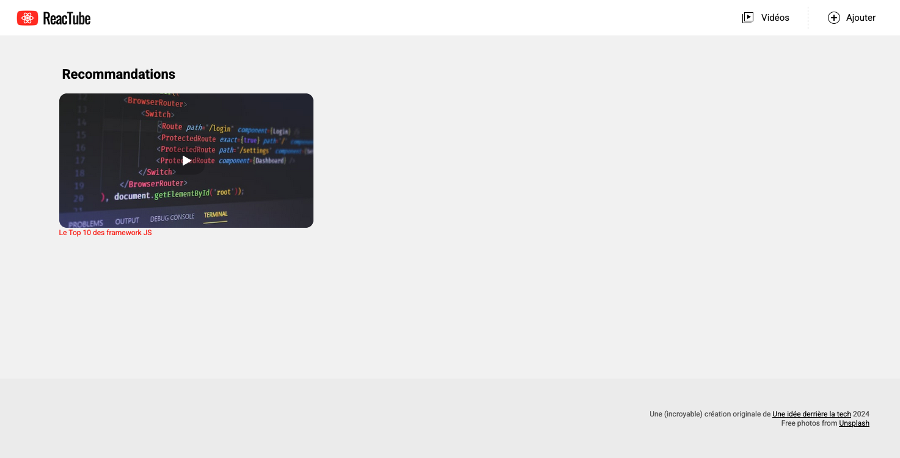
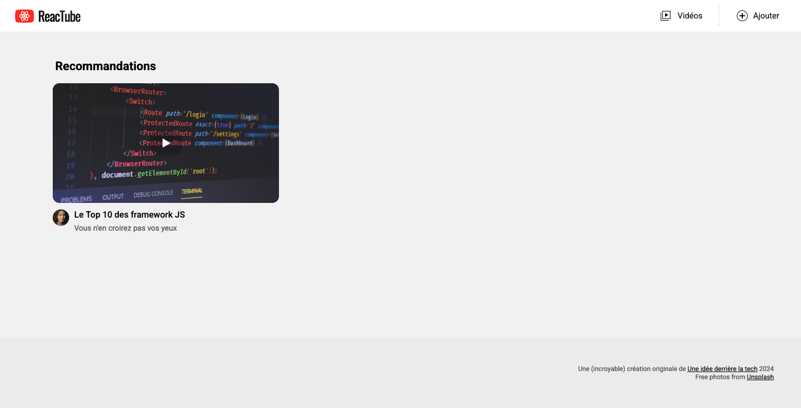

# E. Pour aller plus loin <!-- omit in toc -->

_**Si vous êtes arrivé à cette partie du TP bravo ! 🎉🥂😎 Vous avez terminé les exercices de base du TP !**_

Cette partie bonus du TP va vous permettre de perfectionner encore votre maîtrise des syntaxes JS et d'améliorer un peu notre appli Reactube.

**C'est parti !**

## Sommaire <!-- omit in toc -->
- [E.1. La fonction renderImg](#e1-la-fonction-renderimg)
- [E.2. La fonction renderVideoItem](#e2-la-fonction-rendervideoitem)
- [E.3. la fonction renderVideoList](#e3-la-fonction-rendervideolist)

## E.1. La fonction renderImg
Pour commencer, **créez une nouvelle fonction `renderImg`** (_dans un module `src/renderImg.js`_) qui utilise la fonction `renderElement` et qui s'utilisera comme ceci dans le `main.js` :

```js
const img = renderImg('https://source.unsplash.com/wOHH-NUTvVc/600x340');
document.querySelector( '.videoList' ).innerHTML = img;
```

Le rendu ne doit pas avoir changé :


## E.2. La fonction renderVideoItem

_**L'objectif de cet exercice est comme précédemment d'utiliser une fonction à l'intérieur d'une autre. On va se servir de la fonction `renderImg()` développée à l'instant, à l'intérieur d'une nouvelle fonction : `renderVideoItem()`.**_

Pour que notre VideoItem ne se limite pas à une image, mais qu'il dispose aussi d'un titre, d'une description, etc. on va avoir besoin **d'adapter un peu le fonctionnement de notre fonction renderElement** :

1. **Modifiez le code de la fonction `renderElement()`** pour lui permettre de recevoir dans le paramètre `children` :
	- soit une **chaîne de caractères** (comme c'est déjà le cas actuellement)
	- soit un **tableau de chaînes de caractères.** <br>Par exemple : si `tagName` vaut `"div"` et que `children` vaut `[ "youpi", "ça", "marche" ]` alors `renderElement` retournera la chaîne `"<div>youpiçamarche</div>"`.

	> _**NB2 :** Pour tester si `children` est un tableau (classe `Array`), vous pouvez utiliser l'opérateur [`instanceof` (mdn)](https://developer.mozilla.org/fr/docs/Web/JavaScript/Reference/Op%C3%A9rateurs/instanceof) ou alors la fonction [Array.isArray (mdn)](https://developer.mozilla.org/en-US/docs/Web/JavaScript/Reference/Global_Objects/Array/isArray)_

	Testez votre nouvelle fonction avec le code suivant :
	```js
	const title = renderElement( 'h1', null, ['Vos', ' ', 'recommandations'] );
	document.querySelector('.container > header').innerHTML = title;
	```

2. **Si votre code fonctionne correctement, alors le code suivant doit fonctionner "comme sur des roulettes"** :
	```js
	const videoItem = renderElement(
		'a',
		{name:'href', value:'uploads/video1.mp4'},
		[
			renderImg('https://source.unsplash.com/L8KQIPCODV8/600x340'),
			'Le Top 10 des framework JS'
		]
	);
	document.querySelector( '.videoList' ).innerHTML = videoItem;
	```
	

3. **Ces adaptations faites, créez enfin la fonction `renderVideoItem`** (_dans `src/renderVideoItem.js`, au hasard_). Elle doit obligatoirement, comme dans l'exemple au dessus, utiliser les fonctions **`renderElement`** et  **`renderImg`** :

	Avec le code JS suivant :
	```js
	const video = {
		title:'Le Top 10 des frameworks JS',
		description:'Vous n\'en croirez pas vos yeux',
		file: 'video1.mp4',
		thumbnail: 'L8KQIPCODV8'
	};
	const videoItem = renderVideoItem(video);
	document.querySelector( '.videoList' ).innerHTML = videoItem;
	```
	... le code HTML généré sera :
	```html
	<a href="uploads/video1.mp4">
		
		<section class="infos">
			<h4>Le Top 10 des framework JS</h4>
			<p>Vous n'en croirez pas vos yeux</p>
		</section>
	</a>
	```
	... et le rendu obtenu dans la page sera celui-ci :

	

## E.3. la fonction renderVideoList

_**Après cette petite fonction `renderVideoItem`, attaquons nous à un cas un peu plus complexe : celui de la fonction `renderVideoList`.**_

Cette fonction va nous permettre d'afficher plusieurs vignettes côte à côte grâce à la fonction `renderVideoItem` créée précédemment.

1. **Créez un module `src/data.js` dans lequel vous exporterez le tableau suivant :**
	```js
	[
		{
			id: 1,
			title:'Le Top 10 des frameworks JS',
			description:'Vous n\'en croirez pas vos yeux',
			file: 'video1.mp4',
			thumbnail: 'L8KQIPCODV8'
		},
		{
			id: 2,
			title:'5 bonnes raisons de ne pas fuir cette formation',
			description:'Vous allez halluciner ! Cliquez vite !',
			file: 'video2.mp4',
			thumbnail: 'umyvrlx0ma8'
		},
		{
			id: 3,
			title:'Les plus grands secrets des développeurs React',
			description:'Cliquez et découvrez avant les autres ces astuces incroyables !',
			file: 'video3.mp4',
			thumbnail: 'L1ijLaihN2A'
		},
		{
			id: 4,
			title:'Votre DSI ne veut pas que vous voyiez cette vidéo !',
			description:'Les experts sont formels : cette méthode de développement mystérieuse va changer votre vie.',
			file: 'video4.mp4',
			thumbnail: 'XIVDN9cxOVc'
		},
		{
			id: 5,
			title:'Les gens vous supplieront de développer leur appli !',
			description:'Visionnez cette vidéo au plus vite et apprenez les 1022 méthodes de développement les plus rentables.',
			file: 'video5.mp4',
			thumbnail: 'E9ANYNkN4Sc'
		},
		{
			id: 6,
			title:'Les 12 techniques imparables pour rater un café',
			description:'Vous en avez marre de tout réussir ? Ratez aux moins les cafés grâce à cette vidéo inédite !',
			file: 'video6.mp4',
			thumbnail: 'uwIJbtLpvV4'
		}
	]
	```
2. **Dans le fichier `index.html`, changez le nom de la classe CSS de la balise `<div class="videoList">` en `<div class="page">`**. C'est `renderVideoList` qui sera chargée de créer, à l'intérieur de `<div class="page">`, la `<div class="videoList">`.

3. **Créez enfin la fonction `renderVideoList` dans le fichier `src/renderVideoList.js`** :
	- instanciez la dans `src/main.js` comme ceci :
		```js
		// `data` est le tableau défini dans `src/data.js`
		const videoList = renderVideoList(data);
		document.querySelector( '.page' ).innerHTML = videoList;
		```
	-  le code HTML retourné `renderVideoList()` sera une balise `<div class="videoList">...</div>`
	-  pour chaque cellule du tableau `data`, `renderVideoList` appellera `renderVideoItem` et injectera le résultat à l'intérieur de la `<div class="videoList">...</div>`

	> _**NB :** c'est le moment d'utiliser la méthode [Array.map](https://developer.mozilla.org/fr/docs/Web/JavaScript/Reference/Objets_globaux/Array/map)_ 🙂

	Le résultat attendu est le suivant :

	

**Et voilà, c'est la fin de ce TP, rendez-vous très vite pour le prochain chapitre !**