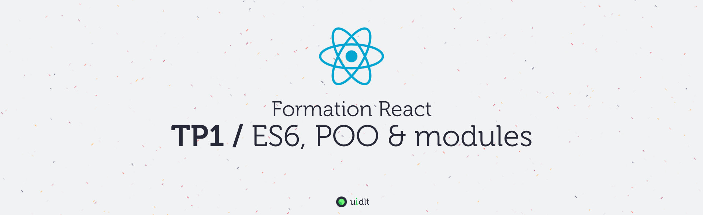

## Objectifs
- Mettre en place un environnement de développement JS
- Lancer le projet de base qui servira aux TPs
- Prendre en main les outils de debug (devtools)

## Sommaire
Pour plus de clarté, les instructions du TP se trouvent dans des fichiers distincts (un fichier par sujet), procédez dans l'ordre sinon, ça fonctionnera beaucoup moins bien !

1. [A. Préparatifs](./A-preparatifs.md)
2. [B. Intégration du JS](./B-integration.md)
3. [C. Serveur API REST](./C-serveur-rest.md)
4. [D. Les devtools](./D-devtools.md)
